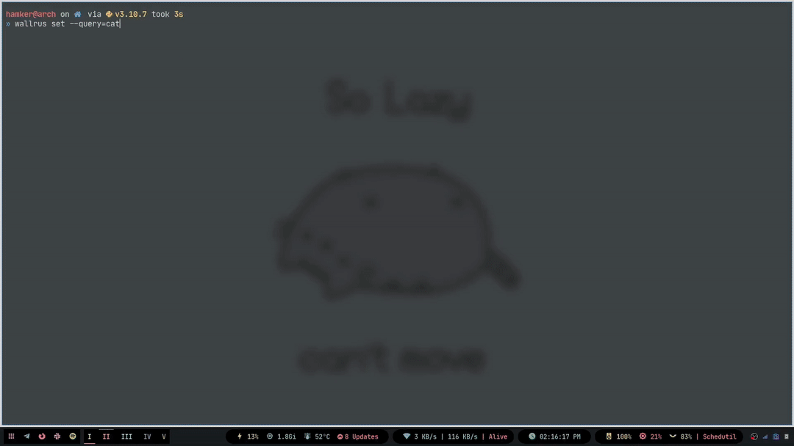

# wallrus
`Wallrus` is a simple and blazing-fast wallpaper manager for linux. 

It wraps around [`feh`](https://github.com/derf/feh) to provide a simple, fast, feature-rich and user-friendly experience.

Quick links:
* [Features](#features)
* [Demo](#demo)
* [Usage](#usage)
* [Examples](#examples)
* [Installation](#installation)

## Features

- [x] Fetching wallpapers online.
- [x] Supports multiple monitor.
- [x] Automatically change wallpapers using [`cron`](https://crontab.guru/) expressions (wallpaper slideshow).
- [x] Supports multiple modes [center, fill, scale, tile]
- [x] Saving fetched wallpapers to a file.
- [ ] Aquiring currently applied wallpaper and saving it to a file. (if set by feh)

## Demo



## Usage

```console
$ wallrus --help
wallrus x.x.x
TheHamkerCat <TheHamkerCat@gmail.com>
A simple wallpaper manager for X11

USAGE:
    wallrus <SUBCOMMAND>

OPTIONS:
    -h, --help       Print help information
    -V, --version    Print version information

SUBCOMMANDS:
    help    Print this message or the help of the given subcommand(s)
    set     Set wallpaper by giving an image path or a query to search online.


$ wallrus set --help
Set wallpaper by giving an image path or a query to search online.

USAGE:
    wallrus set [OPTIONS]

OPTIONS:
    -c, --cron <cron>      Add current wallpaper command to crontab to change wallpaper
                           automatically. (Only works with --query)
    -h, --help             Print help information
    -m, --mode <mode>      The mode to set the wallpaper. [default: fill] [possible values: center,
                           fill, scale, tile]
    -p, --path <path>      Path to the wallpaper. Use $HOME instead of ~/
    -q, --query <query>    The query to search for. Pass `trending` for trending wallpapers
    -s, --save <save>      Save the newly fetched wallpaper in a new file. (Only works with --query)
    -x, --noxinerama       Disables Xinerama support, Making the wallpaper span across all monitors.
```

## Examples
### Set a local wallpaper

```console
$ wallrus set --path=/path/to/wallpaper.jpg
```

### Fetch & Set a wallpaper online

```console
$ wallrus set --query=batman
```

### Get trending ones instead

```console
$ wallrus set --query=trending
```

### Save wallpaper after setting

```console
$ wallrus set --query=batman --save=a.png
```

### Change wallpaper every hour

```console
$ wallrus set --query=avengers --cron="0 * * * *"
```

## Installation

```console
$ git clone https://github.com/TheHamkerCat/wallrus
$ cd wallrus
$ bash ./install.sh
```
